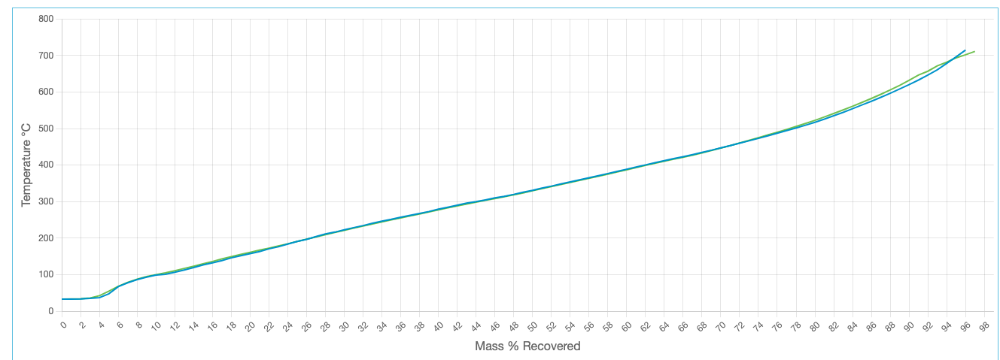

# Crude Distillation

When blending two different kinds of oil together, each of the oil's properties (e.g.: sulphur content, density, etc.) are combined via specific rules. One property of particular importance is the Distillation Profile; usually given as a table or a chart of the form:

05% : 45°C \
10% : 95°C \
20% : 101°C \
30% : 140°C \
40% : 179°C \
50% : 210°C \
60% : 225°C \
70% : 260°C \
80% : 310°C \
90% : 330°C \
95% : 360°C \
99% : 381°C

What this represents is the temperature in °C at which X % of the oil has evaporated; e.g.: for the above table, 50% of the oil has evaporated at 210°C.
In essence, this is a discrete snapshot of a function that takes in percentage, and returns the temperature.

The goal of the project is to create a model which will give an pproximate distillation profile of the mixture of the two oils with specific volumes.

## Methdology

The project is collecting the data from Crude Monitor, covering the 61 crudes of 4866 sample profiles from 2013 Jan to 2023 Jan. The crude profile include basic analysis, light ends and simulated distillation. [Here](https://github.com/fanchen0227/crude-distillation/blob/develop/docs/pandas_profiling_report.pdf) is the data exploration profile report.

The idea is to train a ML model to predict the distillation profile based on the feature of basic analysis and light ends. We built the 61 crudes' profile based on the latest sample data. Then we built a function that calculated the features of the mixture based on physical properties. 

With the calculated features of mixture, we can predict the distillation profile. 

## Assumption & Simplification:
### Distillation Prediction
1. The stimulated distillation from crude monitor is the actual distillation profile for the crude. The accuracy of the stimulated distillation will affect our model accuracy since we use stimulation as dependent variable.
2. The feature of basic analysis and light ends are sufficient enough to predict the distillation profile. No other features will be added due to availability. 
3. The purpose of the model is to predict. We don't pay to much on model interpretability.
### Feature Calculation of Physical Properties
1. The volume of mixture is the sum of the volumes of two crudes. 
2. Gravity of the mixture can be calculated based on the volume.

## Modelling

### Features
Y(dependent variable) is the tempareture. \
X(independent variable) is the features including: 'Absolute Density (kg/m3)', 'Gravity (&degAPI)', 'Sulphur (wt%)', 'MCR (wt%)', 'Sediment (ppmw)', 'TAN (mgKOH/g)', 'Salt (ptb)', 'Nickel (mg/kg)', 'Vanadium (mg/kg)','C1 Methane (vol%)', 'C2 Ethane (vol%)', 'C3 Propane (vol%)', 'iC4 iso-Butane (vol%)', 'nC4 n-Butane (vol%)',
 'iC5 iso-Pentane (vol%)', 'nC5 n-Pentane (vol%)', 'C6 Hexanes (vol%)', 'C7 Heptanes (vol%)', 'C8 Octanes (vol%)', 'C9 Nonanes (vol%)', 'C10 Decanes (vol%)', '%mass'

After data cleaning and transformation, we get the dataset of 93402 rows. Then we split the dataset into training set and testing with the ratio of 7:3.

### Model Selection
The random forest model with maximum depth of 12 and 200 estimators is the champion of trained models. Cross validation of hyper-parameter tuning is used for model selection and prevent overfitting. 

### Model Evaluation
The performance in the test set is \
Mean absolute error (MAE): 11.005 \
Root mean sqaure error (RMSE): 16.138 \
R square (r2): 0.9931


## Deployment

The trained random forest model is compressed and output as a joblib file. The model, crudes profile and feature function in src folder were zipped and deployed in [google cloud function](https://cloud.google.com/functions). We can call the API by using the url that contains crude variables to get the distillation profile line chart of the mixture.

https://northamerica-northeast1-durable-cacao-374303.cloudfunctions.net/crude?name1={name1}&volume1={volume1}&name2={name2}&volume2={volume2}
    
    Args:
        name1: the name of the crude 1. The upper case matters.
        volume1: the volume of the crude 1 added - unit liters.
        name2: the name of the crude 2. The upper case matters.
        volume2: the volume of the crude 2 added - unit liters.

Example:

If we mix 1L of Pembina and 5L of Western Canadian Select, the variables and url will be: \
name1 = Pembina \
volume1 = 1 \
name2 = Western_Canadian_Select \
volume2 = 5

https://northamerica-northeast1-durable-cacao-374303.cloudfunctions.net/crude?name1=Pembina&volume1=1&name2=Western_Canadian_Select&volume2=5


If we would like to get the json instead of the html chart, add '&json_y=y' at the end of the url. \
Example: \
https://northamerica-northeast1-durable-cacao-374303.cloudfunctions.net/crude?name1=Pembina&volume1=1&name2=Western_Canadian_Select&volume2=5&json_y=y


## Local Testing
Before start local testing, we need to create an virtual environment and install dependencies:
```shell
python -m venv venv
source venv/bin/activate
pip install -r src/requirements.txt
```

If we want to test the application locally, we can run the comment below to start the local server:
```
cd src
functions-framework --target predict --debug
```
After this, the local server will be hosted at http://127.0.0.1:8080/ \
Eaxmple url to test locally: \
http://127.0.0.1:8080/?name1=Pembina&volume1=1&name2=Western_Canadian_Select&volume2=0

We can run the test script to check if the local service is working well:
```
python3 tests/integration_testing.py True
```

If we would like to test the service running on GCP, We can run the test script:
```
python3 tests/integration_testing.py False
```

## Dollar Value to Model Error

Take this chart as an example. The green line is the actual distillation profile while the blue one is predicted. The temperature difference between prediction and actual value is around 10 °C (the model error (MAE) is around 11°C). When the temperature reaches 700°C, based on the prediction, the mass recovered rate should be 96% but the actual mass recovered rate is 95%. So the 1% difference is the recovery loss caused by the model error.  For 1 ton of crude, we may lose 0.01 ton of product recovered from the crude. Assume the product is petrol, whose unit price is 150 cents/liter, the loss of 0.01 tons of gas is 28.3 liters, worth $42.5. 

## Future Improvment
1. For some crude(eg.[Light Smiley](https://crudemonitor.ca/crudes/crude.php?acr=MSY)), when the mass% receovered reaches some point(eg. 95%), the residule won't further decrease. In this case, the temperature after that points cannot be predicted and should be null. We can build a model to predict what crude will have what threshould point to make the prediction of distillation more accurate. 
2. We can try to add features (eg. BTEX) which is not available from Crude Monitor API. Check if it's improving the model. 
3. Explore other ML algrithms of prediction and adjust the function of property calculation.